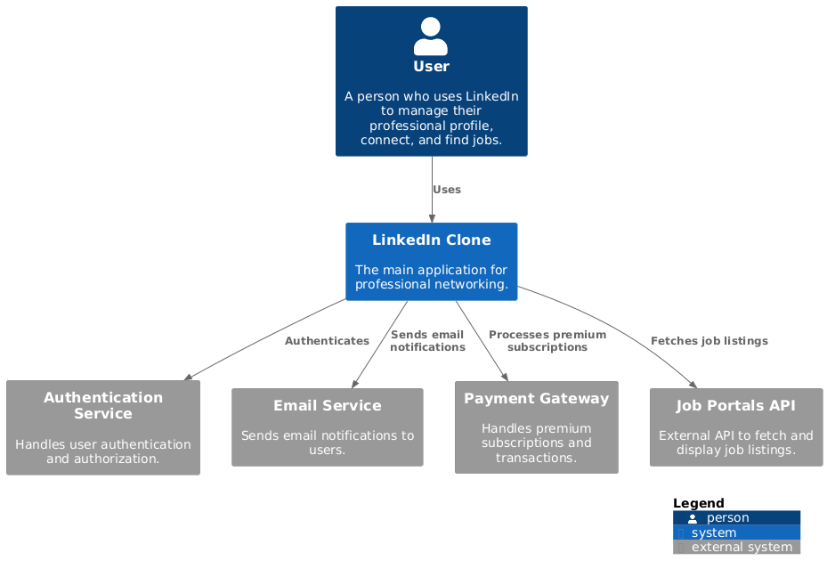
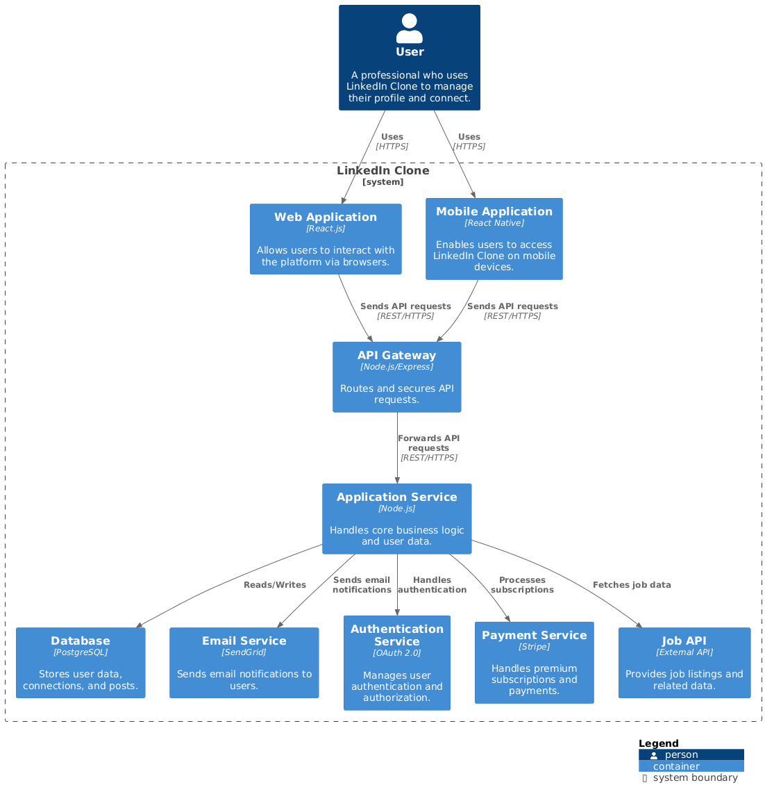
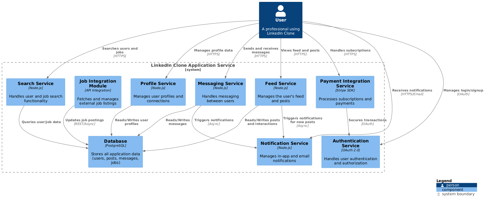
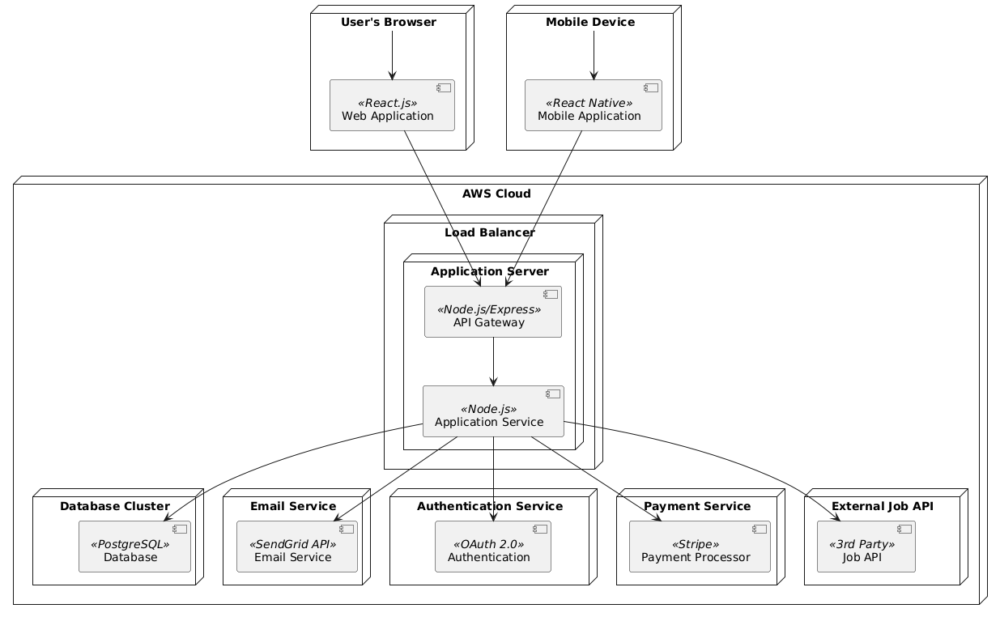
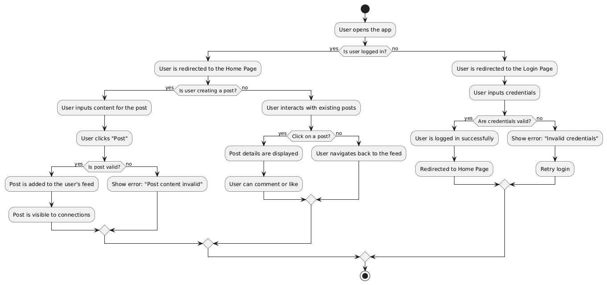

# System Architecture for LinkedIn Clone

## Overview
This document describes the architecture of the LinkedIn Clone application. It includes system context, container, component, deployment, and activity diagrams to provide a comprehensive view of the system's design and implementation.

---

## System Context
The system context diagram provides an overview of how the LinkedIn Clone interacts with external users and systems.

### Diagram

### Description
- **Actors**:
  - **Users**: End-users who interact with the platform to post, comment, like, and connect.
  - **Admin**: Manages moderation, content policies, and platform analytics.
  - **External APIs**: Integrated services for notifications, payments, and analytics.

- **Interactions**:
  - Users log in through a web or mobile interface to interact with the platform.
  - Admin uses a separate interface to manage content and users.
  - External APIs provide services like notifications, payments, etc.

---

## Container Diagram
The container diagram visualizes the major containers (applications or services) in the LinkedIn Clone system and how they communicate with each other.

### Diagram

### Description
- **Web Application**: The front-end application that users interact with, developed using React.js.
- **API Server**: The back-end REST API, built with Node.js and Express, handles requests, performs business logic, and serves data.
- **Database**: A relational database (PostgreSQL) stores user profiles, posts, connections, and messages.
- **Authentication Service**: A service that handles user authentication using JWT tokens.
- **External Services**: Payment gateway and analytics services integrated into the platform.

---

## Component Diagram
(Optional, if applicable)

### Diagram

### Description
The component diagram shows the different components within the containers and their relationships. Each component plays a role in handling specific features such as user profiles, messaging, and notifications.

---

## Deployment Diagram
The deployment diagram describes the hardware and software environment where the LinkedIn Clone system will be deployed.

### Diagram

### Description
- **Web Server**: Hosts the React.js front-end application.
- **Application Server**: Hosts the Node.js backend API server.
- **Database Server**: Hosts the PostgreSQL database, accessible to the backend server.
- **Cloud Storage**: Stores images, documents, and other media files uploaded by users.
- **Third-Party Services**: Handles analytics, notifications, and payments.

---

## Activity Diagram
The activity diagram illustrates the flow of tasks for common user interactions, such as logging in or posting content.

### Diagram

### Description
The activity diagram shows a sequence of actions that occur when a user logs in:
1. **User Inputs Credentials**
2. **System Verifies Credentials**
3. **If successful, User Gains Access to the Dashboard**
4. **If not, Prompt for Re-authentication**

---
