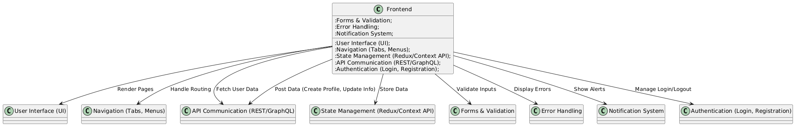
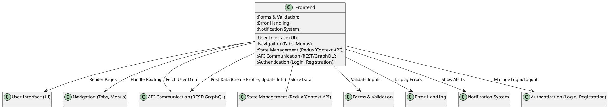
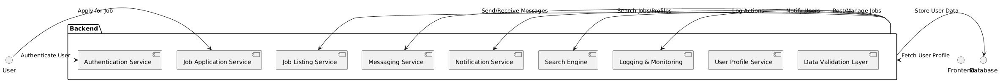
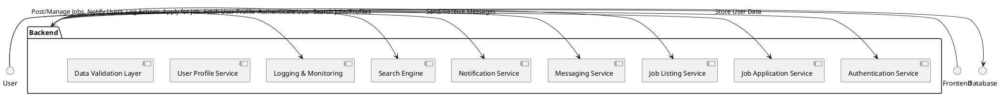
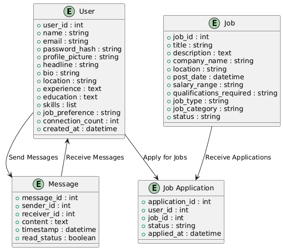
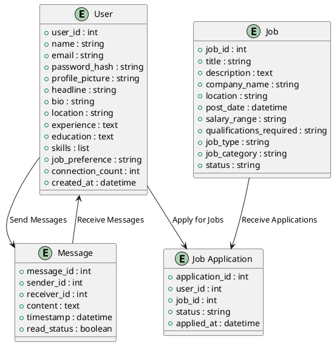
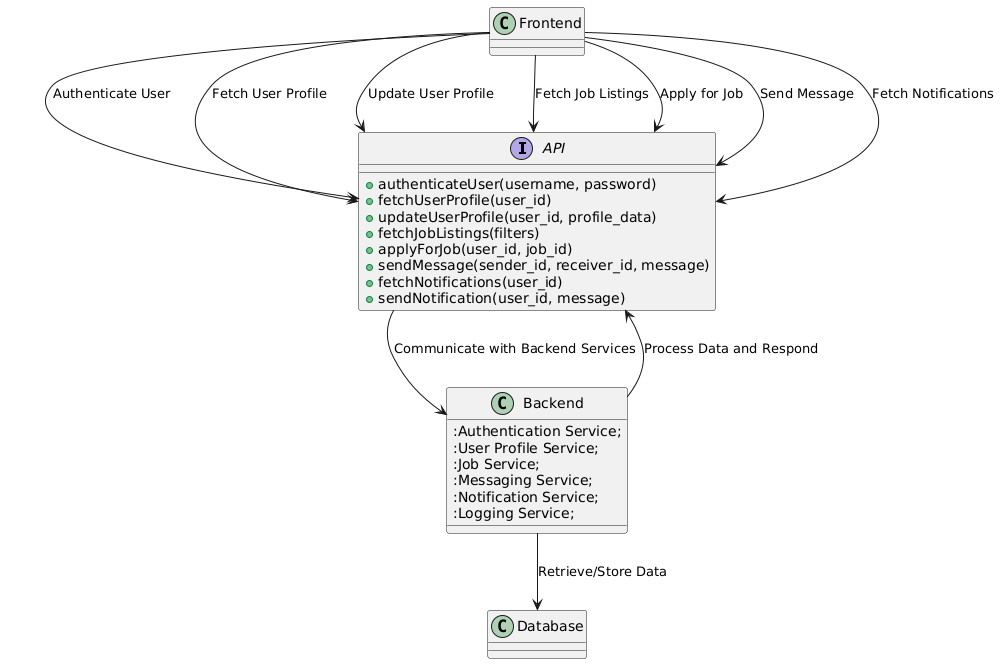

# LinkedIn Clone - Design Documentation

## Table of Contents
- [Overview](#overview)
- [Tech Stack](#tech-stack)
- [Features](#features)
- [Architecture](#architecture)
- [API Design](#api-design)
- [Database Design](#database-design)
- [Interface Design](#interface-design)
- [Challenges & Solutions](#challenges-solutions)
- [Testing & Validation](#testing-validation)

## Overview
The LinkedIn Clone is a platform that replicates core features of LinkedIn, providing users with a professional network to connect, post updates, and explore job opportunities. It allows users to create a professional profile, interact with others, and explore content, similar to the original LinkedIn platform.

## Tech Stack
- **Frontend:**
  - HTML, CSS, JavaScript (ES6+)
  - React.js
  - Redux for state management
  - Axios for HTTP requests
  - Bootstrap for styling
- **Backend:**
  - Node.js
  - Express.js
  - MongoDB (for database)
- **Authentication:**
  - JWT (JSON Web Token)
- **Deployment:**
  - Heroku for the backend
  - Netlify for the frontend

## Features
- **User Authentication:**
  - Login and Sign up functionality
  - JWT-based authentication system
- **Profile Management:**
  - Users can create and update their profiles
  - Add experience, education, skills, etc.
  - Profile visibility settings (Public/Private)
- **Feed:**
  - Post updates (Text, images, videos)
  - Like and comment on posts
  - Share posts
- **Connection System:**
  - Send connection requests
  - Accept or reject connection requests
  - View connections and their activities
- **Search Functionality:**
  - Search users by name, skills, or job title
  - Filter search results based on location, company, etc.
- **Job Opportunities:**
  - View job postings
  - Apply for jobs
  - Follow companies for job updates

## Architecture

### Frontend Architecture





The frontend is built using React.js, following a component-based architecture to ensure reusability and maintainability. The structure includes:
- **App.js:** Main entry point
- **Components:**
  - `Navbar.js` – Contains the navigation bar.
  - `Profile.js` – Displays the user’s profile information.
  - `Feed.js` – Shows the posts from users.
  - `Post.js` – Individual post component.
  - `JobBoard.js` – Displays job listings.
- **Redux Store:** Used to manage global state (user data, posts, etc.).
- **Routing:** React Router for navigation between pages.

### Backend Architecture





The backend is built using Node.js with Express.js to handle routing and API requests. Key components:
- **Server.js:** Main entry point for the server.
- **Routes:**
  - `authRoutes.js` – Handles user authentication routes (login, signup).
  - `profileRoutes.js` – Handles profile creation and updates.
  - `postRoutes.js` – Manages post creation, updating, and deletion.
  - `jobRoutes.js` – Job listing and application routes.
- **Controllers:** Business logic for handling requests.
- **Models:** Defines MongoDB schemas for users, posts, and job applications.
- **Database:** MongoDB to store user information, posts, and job opportunities.

### Database Design





## *Component Diagram*
### *Purpose*
The Component Diagram delves into the internal structure of the *API Server*, showcasing core components such as the Authentication Service, Job Management Service, and Profile Management Service.

### *Diagram*

---

## *Code-Level Diagram*
### *Purpose*
This section describes the code-level architecture for specific modules like authentication and user profile management.

### *Diagram*

---

The database is built using MongoDB with the following key collections:
1. **Users:**
   - Fields: `username`, `email`, `password`, `profilePic`, `connections`, `skills`, `location`, `education`, `experience`, `visibilitySettings`
   - Stores information about each user.

2. **Posts:**
   - Fields: `userId`, `content`, `media`, `likes`, `comments`, `timestamp`
   - Stores the posts shared by users.

3. **Connections:**
   - Fields: `userId`, `connectionId`, `status`
   - Tracks the relationships between users (pending, accepted, etc.).

4. **Jobs:**
   - Fields: `companyName`, `position`, `location`, `description`, `requirements`, `postedBy`
   - Stores job listings.

## API Design

### Authentication APIs
1. **POST /auth/signup**
   - Input: `username`, `email`, `password`
   - Output: `JWT token`
   - Description: Registers a new user and returns a JWT token for authentication.

2. **POST /auth/login**
   - Input: `email`, `password`
   - Output: `JWT token`
   - Description: Authenticates a user and returns a JWT token for access to protected routes.

### Profile APIs
1. **GET /profile/:userId**
   - Output: User profile data
   - Description: Retrieves a user’s profile by ID.

2. **PUT /profile/:userId**
   - Input: Updated profile data
   - Output: Updated profile data
   - Description: Updates a user's profile information.

### Post APIs
1. **POST /post**
   - Input: `userId`, `content`, `media`
   - Output: Created post data
   - Description: Creates a new post.

2. **GET /posts**
   - Output: List of posts
   - Description: Retrieves posts from the feed.

### Job APIs
1. **GET /jobs**
   - Output: List of jobs
   - Description: Fetches job listings from the database.

2. **POST /apply**
   - Input: `userId`, `jobId`
   - Output: Confirmation of job application
   - Description: Allows a user to apply for a job.

## Interface Design


```plantuml
@startuml
!define RECTANGLE class
!define DATABASE database
' Database entities with more attributes and relationships
DATABASE User {
    + user_id : int
    + name : string
    + email : string
    + password_hash : string
    + profile_picture : string
    + headline : string
    + bio : string
    + location : string
    + experience : text
    + education : text
    + skills : list
    + job_preference : string
    + connection_count : int
    + created_at : datetime
}

DATABASE Job {
    + job_id : int
    + title : string
    + description : text
    + company_name : string
    + location : string
    + post_date : datetime
    + salary_range : string
    + qualifications_required : string
    + job_type : string
    + job_category : string
    + status : string
}

DATABASE Message {
    + message_id : int
    + sender_id : int
    + receiver_id : int
    + content : text
    + timestamp : datetime
    + read_status : boolean
}

DATABASE Job_Application {
    + application_id : int
    + user_id : int
    + job_id : int
    + status : string
    + applied_at : datetime
}

' Relationships between entities
User --> Job_Application : Apply for Jobs
Job --> Job_Application : Receive Applications
User --> Message : Send Messages
Message --> User : Receive Messages
@enduml
```

The interface design follows modern web design principles with a focus on user experience (UX) and accessibility. The design is responsive, ensuring a smooth experience across desktop and mobile devices.

### 1. **Landing Page**
   - A clean and minimalistic design welcoming new users to sign up or log in.
   - Prominent call-to-action buttons for **Sign Up** and **Log In**.
   - Branding with the LinkedIn Clone logo at the top, followed by sections introducing the platform’s features.

### 2. **Navigation Bar**
   - Includes key options like **Home**, **Profile**, **Feed**, **Search**, **Messages**, and **Jobs**.
   - **Responsive menu** with dropdowns for easier navigation on smaller screens.
   - **Search bar** located on top for easy access to user search functionality.

### 3. **Profile Page**
   - A well-organized user profile with sections like **About**, **Experience**, **Education**, and **Skills**.
   - Options to **Edit Profile** or **Update Profile Picture**.
   - **Visibility settings** to allow users to control who can view their information (Public/Private).

### 4. **Feed Section**
   - The main content area where posts are displayed.
   - Each post includes options to **Like**, **Comment**, and **Share**.
   - **Post creation section** at the top for users to add new posts.
   - A **responsive design** for post interactions across devices.

### 5. **Job Board**
   - Displays a list of job opportunities with **filters** for job title, location, and company.
   - Users can **view job details** and apply directly through the platform.
   - Each job listing will display the **company logo**, **position**, and a **brief description**.

### 6. **Responsive Design**
   - The layout adjusts seamlessly for different screen sizes, from large desktops to mobile phones.
   - **Grid-based layout** for easy viewing on desktops and a **vertical layout** for mobile devices.
   - Accessible buttons, readable text sizes, and mobile-friendly touch interactions for a smooth experience on any device.

### 7. **Notifications & Alerts**
   - Real-time updates for actions like **new connections**, **job posts**, and **messages**.
   - Notifications are presented in a **non-intrusive banner** or **modal dialog box**.

## Challenges & Solutions

### Challenge 1: Handling Large Data Volume in Feed
- **Solution:** Implemented lazy loading and pagination for posts to load data in chunks, reducing initial load time.

### Challenge 2: Real-time Notifications for New Connections and Job Posts
- **Solution:** Used socket.io for real-time communication to notify users about connection requests and job updates instantly.

### Challenge 3: Securing User Data
- **Solution:** Implemented JWT authentication for secure login and access control. Sensitive data is hashed using bcrypt before storing in the database.

## Testing & Validation

- **Frontend Testing:**
  - Unit tests for individual components using Jest.
  - Integration tests for overall page functionality.

- **Backend Testing:**
  - API testing using Postman for endpoint validation.
  - Unit testing for business logic using Mocha/Chai.

- **User Acceptance Testing (UAT):**
  - A group of target users tested key features to ensure the application meets user needs and expectations.

- **Performance Testing:**
  - Load testing to handle a large number of concurrent users using tools like JMeter.

## Conclusion
The LinkedIn Clone aims to offer a similar user experience to the original platform, with the core features implemented using modern technologies. The design follows best practices for scalability, security, and maintainability, ensuring the platform can grow with future needs.
