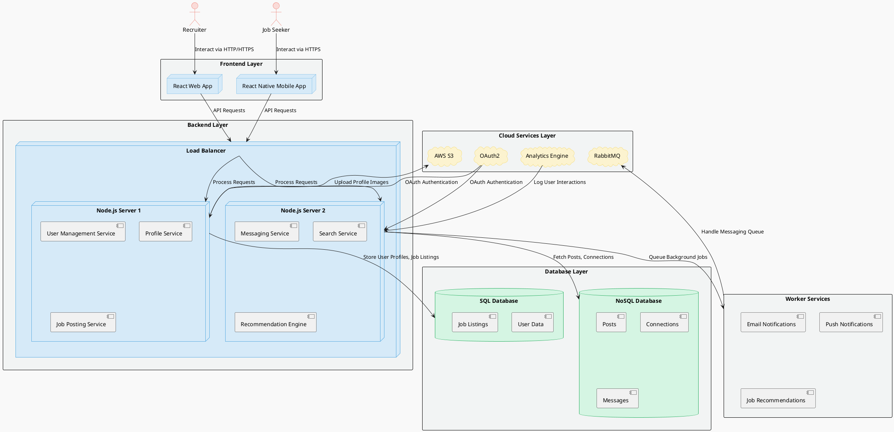

### **Deployment Diagram for LinkedIn Clone**

Below is the Deployment Diagram for the LinkedIn Clone project. This diagram is designed to represent the infrastructure and key components of the system, focusing on Recruiters and Job Seekers as primary actors. The diagram illustrates the structured hierarchy, showcasing the Frontend, Backend, Database, and Cloud Services layers, and how these components interact.

---

#### **Diagram**
  
![Deployment Diagram](https://www.plantuml.com/plantuml/png/XLLHJzim47xthx2wXxt01cs1RGyJQTC8fhPhAOW7j0SdCIKZiJlRGK9J__iklZYOX8mYHSbzdp-VlxipvzemPSeY9_en4pkcM45ZbZnkbIn5EfMvLFH3zBNwynX2ffp-9HH-apOvF9q5qHV4f4gvgkCdOH3EXZOUIM4mEibXETbxqaakoxHFEvf6esdKrOx6uT4eUbSxPOR5JFUdVXATp4PT-U5PC3izUbUU9GRYVQa7uIHymvRPsNWwchwhhNXYcDZcl5T_68sZSKVVAH5CRd354rLcXgi1PPesNmx-8MEwuVonnk4JlmXvIM0GAKYKYvJEsNDDT27C3li3zW9LUijZ6knsbWRlyDgXB9d9dZXTo3ZBUKF6pug_VxLzTVJNkxk8l_bSiXI0d8caPiqdDU65j8JdfzyQZgoUkAB7ljeniflVtOq6oe89jkK55yOkoXB-wpLhfUGzfDs3Llwkf3QPs7OP-_zdD_Ip6xQpMt2jsRQhw_0DPofvw06X3sHHW2mKGWew4o3KIMpVgaFefkcb42waw-nIHnbirlC6jLG8XAuWZRsMWlisTiqpQvV6yBwbkvGTPGYrjIlBjQSxbKBmf3ehHdqBEOOwnvrM5vFpJtk7HW1tmzjh4Dnkw6Q4vnpvmC-WD0zOoEhDXwvO76TciSRUN_jG85Z-RB94OsNmc4smbUUjL32mJQAMYp5NbRjPmR8SV3BPVPOmPuCrgjGF7S1LekaIXy367wdd9Mdk4tfu-BsUTlgDNWe8LOF-b35wSNsz-bmzDiHTBqXtyzvPWMI2SfOwdm0dM5r2IdzA3hKbkBWVXmW0pMm338CAzkW-ol0j2cdM0nDR66WR8nMdjd_hwTS7r6zTuZJjigLq2oDkO2HjSnxuFhQs6G7rPfTBbZfzUbb0exPqwo83ULtoadl_8gfaD76uzNeDj0icKj1gRWvSHqZLcMstREFQdkN2rBtH8GxxYAHfrZPzBhVMELTnFFyve6MH_mC0)

---

---

#### **Description**
The deployment diagram represents the overall infrastructure of the LinkedIn Clone project. It shows the interactions between key actors (Recruiter and Job Seeker) with the **Frontend**, **Backend**, **Databases**, and **Cloud Services** layers. 

- **Frontend Layer:**  
  Contains the React-based web and mobile applications used by Recruiters and Job Seekers.

- **Backend Layer:**  
  A load balancer distributes traffic to two Node.js servers:
  - **Server 1:** Handles user management, profiles, and job postings.
  - **Server 2:** Handles messaging, search functionality, and recommendations.

- **Database Layer:**  
  - **SQL Database:** Stores structured data like user profiles and job listings.  
  - **NoSQL Database:** Stores unstructured data like posts, connections, and messages.

- **Cloud Services Layer:**  
  - **AWS S3:** Stores profile images and other static files.  
  - **OAuth2:** Provides secure authentication.  
  - **RabbitMQ:** Manages messaging queues.  
  - **Analytics Engine:** Logs user interactions for insights.

- **Worker Services:**  
  Performs background tasks such as sending notifications and generating job recommendations.

---

