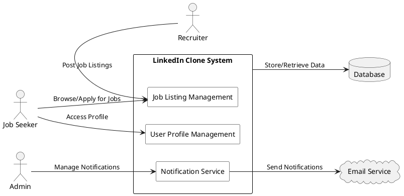

## **System Context Diagram**

### **Title**  
System Context Diagram  

### **Description**  
The System Context Diagram provides an overview of how the LinkedIn Clone interacts with external actors and systems. It shows the major components of the system, including users (job seekers, recruiters, and administrators) and external services (like email notification services and databases).  

---

### **Diagram**  
  

---

### **Code**

---

## **Actor Interactions**

### **Job Seeker**
- Users can create and update their profiles.
- They can browse job listings and apply for jobs directly through the system.

### **Recruiter**
- Recruiters can post job listings for open positions.
- They can review applications submitted by job seekers and manage postings.

### **Admin**
- Admins oversee the management of notifications.
- They handle system-level configurations to ensure smooth operations.

---

## **External Systems**

### **Database**
- The system uses a database to store and retrieve user data, job postings, applications, and other essential records.

### **Email Service**
- The email service handles notifications sent to users, such as job alerts, application updates, and system messages.
